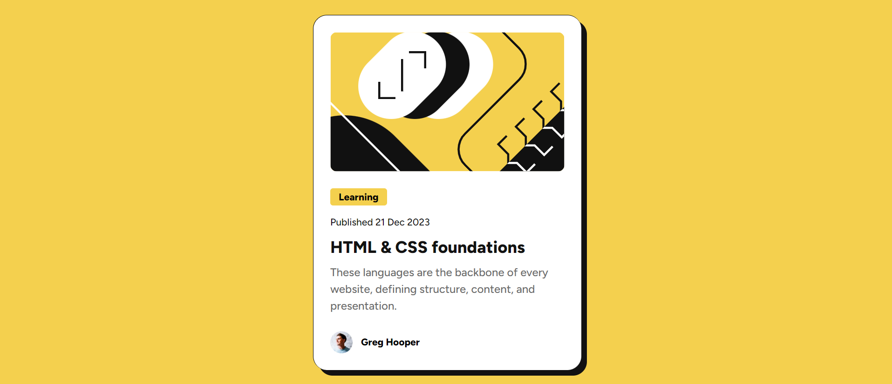

# Frontend Mentor - Blog Preview Card

This is a solution to the [Blog preview card challenge on Frontend Mentor](https://www.frontendmentor.io/challenges/blog-preview-card-ckPaj01IcS).

## Table of contents

- [Overview](#overview)
  - [Screenshot](#screenshot)
  - [Links](#links)
- [My process](#my-process)
  - [Built with](#built-with)
  - [What I learned](#what-i-learned)
- [Author](#author)

## Overview

### Screenshot

### Links

- Solution URL: [Click Me](https://github.com/shakthivel-rn/blog-preview-card)
- Live Site URL: [Click Me](https://shakthivel-rn.github.io/blog-preview-card/)

## My process

### Built with

- HTML5
- CSS3
- Flexbox

### What I learned

- How to use CSS variables to store values, and can be reused in different places in CSS code
- How to effectively use Figma design

## Author

- Website - [Shakthivel Ramesh Nirmala](https://shakthivel-portfolio.vercel.app/)
- Frontend Mentor - [@shakthivel-rn](https://www.frontendmentor.io/profile/shakthivel-rn)
